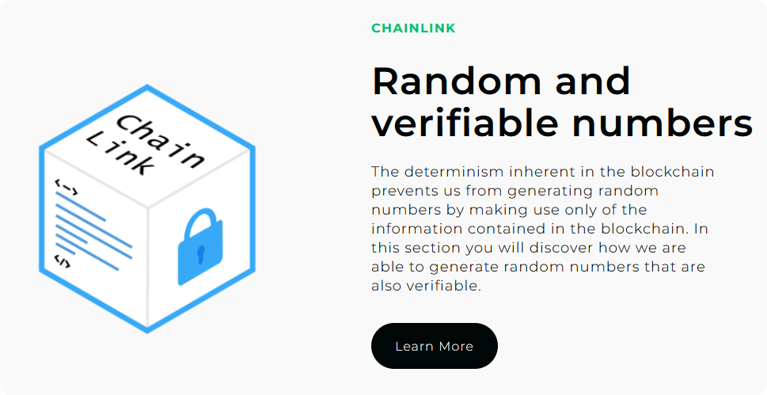

# 3SAT Instance Generator

A blockchain-based decentralized application (DApp) for generating verifiable random instances of the 3-SAT problem, built on Ethereum using Chainlink VRF for provably random number generation.

<div align="center">
    
</div>

##  Overview

The 3SAT Instance Generator is a revolutionary DApp that eliminates the need to trust third parties when generating random test instances for the 3-SAT problem. By leveraging blockchain technology and Chainlink oracles, researchers can generate truly random, verifiable instances for algorithm testing.

<div align="center">
    
</div>

### Key Features
- ✅ **Verifiable Random Generation**: Using Chainlink VRF for provably random numbers
- ✅ **No Third-Party Trust**: Blockchain eliminates trust requirements
- ✅ **Two Generation Algorithms**: Algorithm A and Algorithm B for different instance types
- ✅ **ORCID Integration**: Secure researcher authentication
- ✅ **Instance Management**: Track, view, and solve generated instances
- ✅ **Solution Verification**: Submit and verify algorithm solutions

## 🚀 Live Application

The DApp is deployed on **Sepolia Testnet**:
- **Smart Contract**: `0x8E913f81FeD26A6E3Ba13488E763d199CFC939e6F`
- **Network**: Ethereum Sepolia Testnet
- **Access**: Connect with MetaMask to interact

## 📋 Prerequisites

Before running this DApp, ensure you have:

1. **Node.js** (v14 or higher recommended)
2. **MetaMask** browser extension
3. **Git** for cloning the repository
4. **Sepolia ETH** for transactions
5. **LINK tokens** for Chainlink VRF calls

## 🛠️ Setup Instructions

### Step 1: Clone the Repository

```bash
git clone https://github.com/Joncarre/3sat_instance_generator.git
cd 3sat_instance_generator
```

### Step 2: Install Dependencies

```bash
npm install
```

### Step 3: Configure Environment

Create a `secrets.json` file in the root directory:

```json
{
  "projectId": "your_alchemy_project_id",
  "account_key": "your_private_key_without_0x"
}
```

### Step 4: MetaMask Setup

#### Install MetaMask
1. Go to [MetaMask.io](https://metamask.io/)
2. Install the browser extension
3. Create a new wallet or import existing one

#### Add Sepolia Network
1. Open MetaMask
2. Click network dropdown (top center)
3. Click "Add Network"
4. Enter Sepolia details:
   - **Network Name**: Sepolia
   - **RPC URL**: `https://sepolia.infura.io/v3/YOUR_PROJECT_ID`
   - **Chain ID**: 11155111
   - **Currency Symbol**: ETH
   - **Block Explorer**: `https://sepolia.etherscan.io`

#### Get Test ETH
1. Visit [Sepolia Faucet](https://sepoliafaucet.com/)
2. Enter your wallet address
3. Request test ETH

#### Get LINK Tokens
1. Visit [Chainlink Faucet](https://faucets.chain.link/)
2. Select Sepolia network
3. Enter your wallet address
4. Request LINK tokens

### Step 5: Compile Smart Contracts

```bash
npx hardhat compile
```

### Step 6: Deploy Smart Contract (Optional)

If you want to deploy your own contract:

```bash
npx hardhat run scripts/deploy.js --network sepolia
```

Then update the contract address in `src/App.js`:

```javascript
export const generatorAddress = "YOUR_NEW_CONTRACT_ADDRESS";
```

### Step 7: Start the Application

For Node.js compatibility issues, use:

```bash
# Windows PowerShell
$env:NODE_OPTIONS="--openssl-legacy-provider"; npm start

# macOS/Linux
NODE_OPTIONS="--openssl-legacy-provider" npm start
```

### Step 8: Access the Application

Open your browser and navigate to:
```
http://localhost:3000
```

## Understanding 3-SAT

The Boolean satisfiability problem (3-SAT) is a fundamental NP-complete problem in computer science. It asks whether there exists an assignment of boolean values to variables that makes a given boolean formula true.

### Example 3-SAT Formula
```
(x₁ ∨ ¬x₂ ∨ x₃) ∧ (¬x₁ ∨ x₂ ∨ ¬x₃) ∧ (x₁ ∨ x₂ ∨ x₃)
```

This DApp generates random instances of such formulas for algorithm testing.

## Smart Contract Details

### Key Functions
- `setResearcher()` - Register new researcher
- `createAInstance()` - Generate instances using Algorithm A
- `createBInstance()` - Generate instances using Algorithm B
- `getRandomNumber()` - Request Chainlink VRF
- `solveInstance()` - Submit solution
- `getAllInstances()` - Retrieve user instances

### Chainlink VRF Configuration (Sepolia)
- **VRF Coordinator**: `0x8103B0A8A00be2DDC778e6e7eaa21791Cd364625`
- **LINK Token**: `0x779877A7B0D9E8603169DdbD7836e478b4624789`
- **Key Hash**: `0x474e34a077df58807dbe9c96d3c009b23b3c6d0cce433e59bbf5b34f823bc56c`
- **Fee**: 0.1 LINK per request

## 🛡️ Security Considerations

- **Private Key Security**: Never share or commit private keys
- **Gas Limits**: Transactions use up to 30M gas units
- **ORCID Authentication**: SHA256-based secure authentication
- **Smart Contract Verification**: Contract is verified on Etherscan

## 📝 Project Structure

```
3sat_instance_generator/
├── contracts/              # Solidity smart contracts
│   └── Generator.sol
├── scripts/                # Deployment scripts
│   └── deploy.js
├── src/                    # React frontend
│   ├── components/         # React components
│   ├── pages/             # Page components
│   └── App.js             # Main app component
├── artifacts/             # Compiled contracts
├── hardhat.config.js      # Hardhat configuration
├── package.json           # Dependencies
└── secrets.json           # Environment variables (not in repo)
```

## 🔗 Useful Links

- [Chainlink Documentation](https://docs.chain.link/)
- [Hardhat Documentation](https://hardhat.org/docs)
- [React Documentation](https://reactjs.org/docs)
- [MetaMask Setup Guide](https://metamask.io/download.html)
- [Sepolia Faucet](https://sepoliafaucet.com/)
- [Chainlink Faucet](https://faucets.chain.link/)

**⚠️ Disclaimer**: This is a testnet application for educational and research purposes. Do not use real funds on mainnet without proper security audits.

---
*Created by Jonathan Carrero*